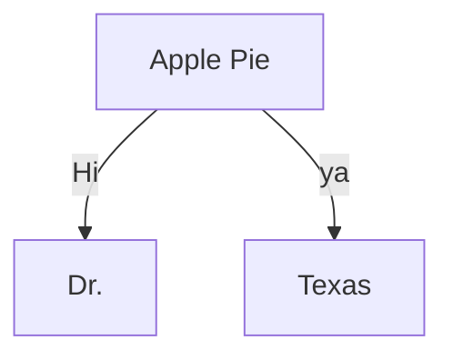

# memo

---

# 学習方法について

## JavaScript
`memo/JavaScript-S.md` に情報を纏めておく。
また、試したコードに関しては `JS/test.js` に記述。

---

# GitHub連携
```
// GitHub上でCode→Clone→HTTPSのタブのリンクをコピー
// Vscodeでリポジトリソースをペースト
// 宛先のローカルフォルダを選択してクローンを実行

cd 宛先ローカルフォルダ // 1
git clone URL // 2
// 1,2の順で行えばおｋ

// アカウント情報を登録しておくと草が生やせる
// 以下をVscodeのコンソールに
git config --global user.name "hoge hoge"
git config --global user.email "hoge@hogemail.com"
// ""無しで打てば現在の設定を確認可能
```

---

# markdown

-  ` * //本文 * ` は斜体にするものだけど、英数字にしか機能せず、 **にほんご** では使用不可。標準で使用しているフォント的に斜体がないっぽい？


---

# 教材

→ 無料の教材まとめ
- `https://qiita.com/KNR109/items/b5dadd056da9b227041b`

---

# mermaid

markdownで図を簡単に作成できるツール。


---

# git AWS CodeCommit クローン

- AWS Management Consoleにログイン
- IAMコンソールを開く。
- ユーザーの詳細ページを開く。
- "セキュリティ認証情報"タブを選択。
- "HTTPS Git認証情報（AWS CodeCommit）"セクションで、"生成"ボタンをクリック。
- 生成されたユーザー名とパスワードをコピー。
- `git clone <URL>` の後、入力を求められるのでそれぞれ打ち込む。
- 終了。